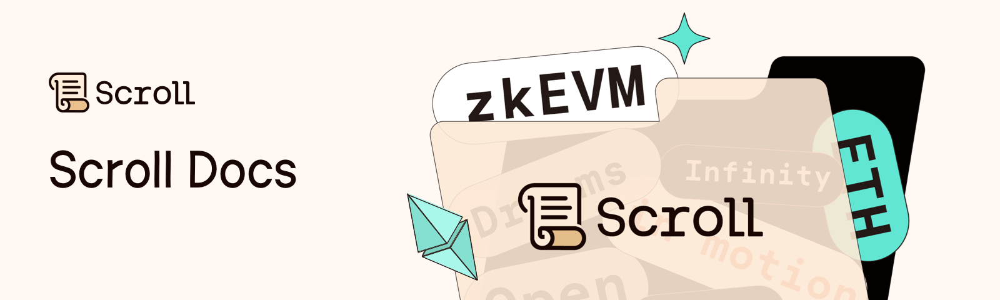

[](https://twitter.com/Scroll_ZKP)
[](https://discord.gg/scroll)

This is the open source project for the Scroll documentation.

## Developing

```
npm install && npm run dev
```

## Docs architecture

- All articles are markdown and stored in `/src/content/docs/`.
- Navigation is JSON in `/src/config/sidebar.ts`

## Tooling on Scroll

If you'd like to add an entry to our [tooling list](http://docs.scroll.xyz/en/developers/scroll-contracts), create a PR to add a new `mdx` file in the [tooling content folder](src/content/tools), using the following template. You can also refer to other existing entries for reference.

```
---
name: "Safe"
category: ["Identity", "Wallet"]
excerpt: "Safe allows you to create smart wallet on chain."
logo: { src: "https://app.safe.global/images/safe-logo-green.png", alt: "Safe Logo" }
website: "https://app.safe.global"
network: ["Mainnet", "Testnet]
noAdditionalInfo: false
---

Add additional info here about how to access this tool on Scroll (ex. contract addresses, tutorials, API URLs)
```

## Credits

- Special thanks to the Chainlink team whose documentation we forked. Their repo is available [here](https://github.com/smartcontractkit/documentation) and viewable at [https://docs.chain.link/](https://docs.chain.link/).
