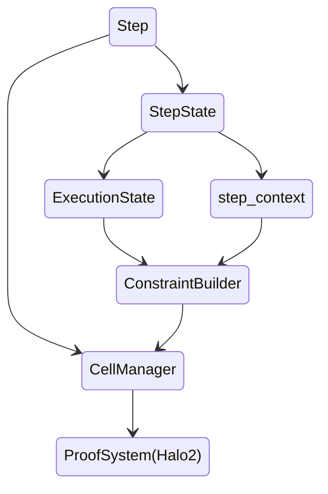

import ClickToZoom from "../../../components/ClickToZoom.astro"
import priceAggr from "../../../assets/images/contract-devs/price-aggr.png"
import ToggleElement from "../../../components/ToggleElement.astro"
import Aside from "../../../components/Aside.astro"
import MarkmapView from "../../../components/MarkmapView/index.astro"
import RPCTable from "../../../components/RPCTable/RPCTable.astro"
import { Tabs, TabsContent } from "../../../components/Tabs"
import Steps from '../../../components/Steps/Steps.astro';

This is body text right under the article title. It typically is just paragraph text that's pretty straightforward. Then there's **bold text**, and _italic text_, and **_bold-italic text_**, and `inline-code` and **`bold inline code`** and even _`italic inline code`_ and **_`bold italic inline code`_**. And of course don't forget [links](#), and [**bold links**](#), and [_italic links_](#), and [**_bold-italic links_**](#).

## Markdown Components (also an H2 Heading)

- We've also got unordered lists!
- They can have multiple items.
  - And some sub-items.
  - That get into details
- That's an unordered list.

What else do we have?

1. Of course there's also ordered lists.
1. They look like this.
1. They're pretty useful.

### H3 Heading

#### H4 Heading

##### H5 Heading

### Steps


<Steps>

1. Import the component into your MDX file:

   ```js
   import { Steps } from '@astrojs/starlight/components';
   ```

2. Wrap `<Steps>` around your ordered list items.

</Steps>

Let's see a horizontal rule.

---

We define the Square-Fibonacci sequence[^1], a variation of the Fibonacci sequence:

### Syntax Highlighting

```js {13-15}
...

const config: HardhatUserConfig = {
  ...
  networks: {
    scrollSepolia: {
      url: 'https://sepolia-rpc.scroll.io' || '',
      accounts:
        process.env.PRIVATE_KEY !== undefined ? [process.env.PRIVATE_KEY] : [],
    },
  },
  etherscan: {
    apiKey: {
      scrollSepolia: <YOUR API KEY>,
    },
    customChains: [
      {
        network: 'scrollSepolia',
        chainId: 534351,
        urls: {
          apiURL: 'https://api-sepolia.scrollscan.com/api',
          browserURL: 'https://sepolia.scrollscan.com/',
        },
      },
    ],
  },
}

...
```

```js "return true;" ins="inserted" del="deleted"
function demo() {
  console.log('These are inserted and deleted marker types');
  // The return statement uses the default marker type
  return true;
}
```

```diff lang="js"
  function thisIsJavaScript() {
    // This entire block gets highlighted as JavaScript,
    // and we can still add diff markers to it!
-   console.log('Old code to be removed')
+   console.log('New and shiny code!')
  }
```


### Math

- Let $f_0 = 1, f_1 = 1$
- For $$i \geq 2$$, define $f_{i} := (f_{i-2})^2 + (f_{i-1})^2 \mod q$
  - Where $q$ is a large prime integer. We use this modulus to bound the size of each element, so that it can be represented by some predetermined number of bits.

### Tables

| Syntax    | Description |
| --------- | ----------- |
| Header    | Title       |
| Paragraph | Text        |

### Blockquotes

> #### Success
>
> Vitae reprehenderit at aliquid error voluptates eum dignissimos.

### Footnotes

Here's a simple footnote,[^1] and here's a longer one.[^bignote]

[^1]: This is the first footnote.
[^bignote]: Here's one with multiple paragraphs and code.

### Callout that worked in MD, but might not in MDX?

:::tip[Did you know?]
Astro helps you build faster websites with “Islands Architecture”.
:::

## Imported MDX Components

### Callouts

<Aside type="note" title="note">
  {" "}
  Astro helps you build faster websites with “Islands Architecture”.{" "}
</Aside>
<Aside type="caution" title="caution">
  {" "}
  Astro helps you build faster websites with “Islands Architecture”.{" "}
</Aside>
<Aside type="danger" title="danger">
  {" "}
  Astro helps you build faster websites with “Islands Architecture”.{" "}
</Aside>

<Aside type="tip" title="tip">
  For .md file you can use this code.
</Aside>

```
:::tip[Did you know?]
 Astro helps you build faster websites with “Islands Architecture”.
:::
```

### Images zoom

<ClickToZoom src={priceAggr} />

### Toggle

<ToggleElement anchor="Why build on Scroll?">
  <div slot="title">Why build on Scroll?</div>
  <p>
    Scroll enables creators to turn their content into interactive, explorable experiences. With Scroll, you can create
    rich, interactive stories that engage readers, provide a better user experience, and help you stand out from the
    crowd.
  </p>
</ToggleElement>
<ToggleElement anchor="How does Scroll work?">
  <div slot="title">How does Scroll work?</div>
  <p>
    Scroll combines powerful technologies like WebGL and WebRTC to create immersive, interactive experiences. The
    platform allows you to build 3D environments, add interactivity, and embed content from popular web services to
    create a unique, engaging experience for your audience.
  </p>
</ToggleElement>
<ToggleElement anchor="What can I build with Scroll?">
  <div slot="title">What can I build with Scroll?</div>
  <p>
    You can build a wide range of experiences with Scroll, from interactive articles to immersive product demos and
    virtual tours. Scroll is designed to help you create engaging, interactive experiences that elevate your content and
    captivate your audience.
  </p>
</ToggleElement>

### Markmap

#### Referenced File

<MarkmapView src="/samples/markmap.md" />

<MarkmapView>
[](#markmap)markmap
===================

- beautiful2
- useful
- easy
- interactive

</MarkmapView>

### Mermaid



### Tabs

<Tabs client:visible>
  <Fragment slot="tab.1">npm</Fragment>
  <Fragment slot="tab.2">yarn</Fragment>
  <Fragment slot="panel.1">```console npm install @chainlink/hardhat-chainlink ```</Fragment>
  <Fragment slot="panel.2">```console yarn add @chainlink/hardhat-chainlink ```</Fragment>
</Tabs>

### TabsContent

<TabsContent sharedStore="vrfMethod" client:visible>
<Fragment slot="tab.1">Subscription</Fragment>
<Fragment slot="tab.2">Direct funding</Fragment>
<Fragment slot="panel.1">

For Chainlink VRF v2 to fulfill your requests, you must maintain a sufficient amount of LINK in your subscription balance. Gas cost calculation includes the following variables:

- **Gas price:** The current gas price, which fluctuates depending on network conditions.

- **Callback gas:** The amount of gas used for the callback request that returns your requested random values.

- **Verification gas:** The amount of gas used to verify randomness on-chain.

The gas price depends on current network conditions. The callback gas depends on your callback function, and the number of random values in your request. The cost of each request is final only after the transaction is complete, but you define the limits you are willing to spend for the request with the following variables:

- **Gas lane:** The maximum gas price you are willing to pay for a request in wei. Define this limit by specifying the appropriate `keyHash` in your request. The limits of each gas lane are important for handling gas price spikes when Chainlink VRF bumps the gas price to fulfill your request quickly.

- **Callback gas limit:** Specifies the maximum amount of gas you are willing to spend on the callback request. Define this limit by specifying the `callbackGasLimit` value in your request.

</Fragment>
<Fragment slot="panel.2">

For Chainlink VRF v2 to fulfill your requests, you must have a sufficient amount of LINK in your consuming contract. Gas cost calculation includes the following variables:

- **Gas price:** The current gas price, which fluctuates depending on network conditions.

- **Callback gas:** The amount of gas used for the callback request that returns your requested random values. The callback gas depends on your callback function and the number of random values in your request. Set the **callback gas limit** to specify the maximum amount of gas you are willing to spend on the callback request.

- **Verification gas:** The amount of gas used to verify randomness on-chain.

- **Wrapper overhead gas:** The amount of gas used by the VRF Wrapper contract. See the [Request and Receive Data](/vrf/v2/direct-funding#request-and-receive-data) section for details about the VRF v2 Wrapper contract design.

Because the consuming contract directly pays the LINK for the request, the cost is calculated during the request and not during the callback when the randomness is fulfilled. Test your callback function to learn how to correctly estimate the callback gas limit.

- If the gas limit is underestimated, the callback fails and the consuming contract is still charged for the work done to generate the requested random values.
- If the gas limit is overestimated, the callback function will be executed but your contract is not refunded for the excess gas amount that you paid.

Make sure that your consuming contracts are funded with enough LINK tokens to cover the transaction costs. If the consuming contract doesn't have enough LINK tokens, your request will revert.

</Fragment>
</TabsContent>

### RPC Table

<RPCTable />