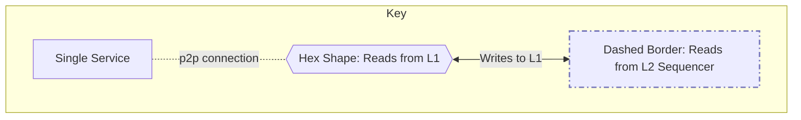
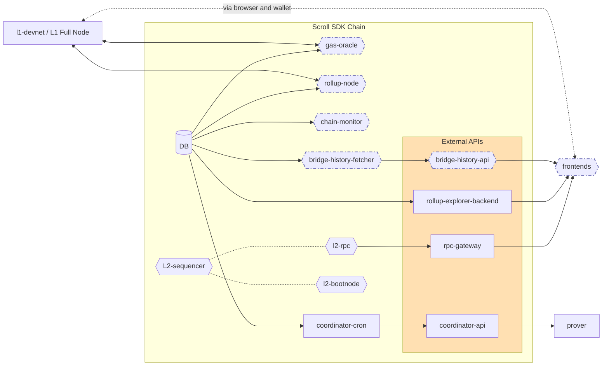

import Aside from "../../../../../components/Aside.astro"

<Aside type="danger">
This information may not reflect the refactor from 08/26/2024. We intend to update this information soon.
</Aside>

## Overview

Scroll SDK is composed of various services that work together to create a functional rollup. This article provides an overview of these services, their roles, and how they contribute to the overall architecture of Scroll SDK.

We'll start by listing the services required for a minimal deployment, followed by a detailed description of each service. This information will help you understand the components of Scroll SDK and make informed decisions about which services to enable or disable based on your specific needs.

This covers the full list of items in [values.yaml](https://github.com/scroll-tech/scroll-sdk/blob/develop/charts/scroll-sdk/values.yaml), which allows for enabling or disabling of specific services.

**New to Scroll’s Architecture?** Check out [this article](/en/technology/chain/rollup/) for more general info.

## Helm & Kubernetes

TODO: Here we describe the project setup, where configuration files are for each service, mention that they're auto-generated by the docker image mentioned in [Configuration](/en/sdk/technical-stack/configuration), and maybe a nice diagram showing how they relate to one another.

### Ingress DNS

The following services need to be exposed to clients outside of the cluster and have ingresses setup by default, along with DNS names that make them accessible in local deployments if yours `etc/hosts` file is appropriately configured:

| Name                | Host                          | Port |
|---------------------|-------------------------------|------|
| admin-system-dashboard | [admin-system-dashboard.scrollsdk](http://admin-system-dashboard.scrollsdk)  | 80   |
| blockscout          | [blockscout.scrollsdk](http://blockscout.scrollsdk)          | 80   |
| bridge-history-api  | [bridge-history-api.scrollsdk](http://bridge-history-api.scrollsdk)  | 80   |
| frontends           | [frontends.scrollsdk](http://frontends.scrollsdk)           | 80   |
| grafana             | [grafana.scrollsdk](http://grafana.scrollsdk)             | 80   |
| l1-devnet           | [l1-devnet.scrollsdk](http://l1-devnet.scrollsdk)           | 80   |
| l1-explorer         | [l1-devnet-explorer.scrollsdk](http://l1-devnet-explorer.scrollsdk)  | 80   |
| l2-rpc              | [l2-rpc.scrollsdk](http://l2-rpc.scrollsdk)              | 80   |

# Deployment Configurations

Below, we describe three configurations for services:
- **Default**: a robust, local test environment and the default `values.yaml`
- **Minimal**: the minimal required components for a testnet (with notes on possible replacements) 
- **Production**: the minimal recommended components for a mainnet, including ZK proof generation

> ✅: Required
> 
> ⚠️: Recommended, but substitutions are available or reasonably possible.
> 
> ❔️: To be assessed.

| Service                 | Default | Minimal | Production |
| ----------------------- | :-----: | :-----: | :--------: |
| admin-system-backend    | ✅      |         |            |  
| admin-system-cron       | ✅      |         |            | 
| admin-system-dashboard  | ✅      |         |            |
| balance-checker         |         |         |  ⚠️         |
| blockscout              | ✅      |         |            |
| blockscout-sc-verifier  | ❔      |         |            |
| bridge-history-api [^1]     | ✅  | ✅      | ✅        |
| bridge-history-fetcher [^1] | ✅  | ✅      | ✅        |
| chain-monitor           |         | ✅      | ✅        |
| contracts               | ✅      | ✅      | ✅        |
| coordinator-api [^2]    |         |         | ✅        |
| coordinator-cron [^2]   |         |         | ✅        |
| frontends               | ✅      |         | ⚠️         |
| gas-oracle              | ✅      | ✅      | ✅        |
| grafana                 | ✅      |         |  ⚠️        |
| kube-prometheus-stack   | ✅      |         |           |
| l1-devnet               | ✅      |         |           |
| l1-explorer             | ✅      |         |           |
| l2-bootnode             | ❔      |         | ✅        |
| l2-rpc                  | ✅      |         | ✅        |
| l2-sequencer            | ✅      | ✅      | ✅        |
| loki-stack              | ✅      |         | ⚠️ |
| postgresql              | ✅      | ⚠️      | ⚠️   |
| rollup-explorer-backend | ✅      |         |           |
| rollup-node             | ✅      | ✅      | ✅        |
| rpc-gateway             | ✅      |         | ✅        |

[^1]: Services necessary for claiming funds bridged from L2 to L1 and used by bridge frontend. Could be replaced by [Bridge History SDK](https://github.com/scroll-tech/scroll-bridge-sdk) for other usage.
[^2]: Only necessary for chains after testnet, when proof generation is needed.

## Services Overview

#### Anvil (`l1-devnet`)

Foundry [Anvil](https://book.getfoundry.sh/reference/anvil/) serves as the default local base chain for devnet deployments. It provides a simulated Ethereum environment for testing and development purposes.

#### Admin System Dashboard (`admin-system-dashboard`)

The Admin System Dashboard is a simple Web UI for monitoring the Scroll SDK chain. It provides a high-level overview of the network's health and status, including the number of transactions, blocks, prover info, and other key metrics.

{/* TODO: Describe Admin system better. */}

{/* ### Admin System Backend (`admin-system-backend`) */}

{/* ### Admin System Cron (`admin-system-cron`) */}

#### Blockscout (`blockscout`)

[Blockscout](https://docs.blockscout.com/) is an open-source block explorer with an Indexer and WebUI configured specifically for the Scroll SDK chain. It allows users to view and interact with blockchain data in a user-friendly interface. We're working with the Blockscout team to implement more Scroll SDK specific features to better support new chain deployments.

#### Bridge History API (`bridge-history-api`)

The [Bridge History API](https://github.com/scroll-tech/scroll/tree/develop/bridge-history-api) is used by frontends for reporting a user's bridging history and generating withdrawal proofs for L2 → L1 bridge claims. It provides essential functionality for cross-chain operations.

#### Bridge History Fetcher (`bridge-history-fetcher`)

The [Bridge History Fetcher](https://github.com/scroll-tech/scroll/tree/0fd7a877cebc3be74aa4d5d2e1592a83f45ed75a/bridge-history-api) is an indexer that continuously collects all user bridging transactions. It ensures that bridging data is up-to-date and readily available for the Bridge History API.

#### Balance Checker (`balance-checker`)

The Balance Checker is a simple service to track and monitor the balances of some operator accounts and contracts, such as fee vaults and commit senders. Alerts happen via Slack notification.

#### Chain Monitor (`chain-monitor`)

The [Chain Monitor](https://github.com/scroll-tech/chain-monitor) is a security service that short-circuits batch finalization if certain invariants are not satisfied. While optional, it is recommended for enhanced security.

<Aside type="danger">
As of July 31, 2024, `chain-monitor` does not allow for finalization in any context. This is a known issue that we're looking into.
</Aside>

#### Contracts (`contracts`)

The Contracts service contains scripts to deploy necessary [chain contracts](https://github.com/scroll-tech/scroll-contracts) (rollup and bridge) on both L1 and L2. It ensures that the required smart contracts are in place for the Scroll SDK to function properly.

<Aside type="tip">
In future iterations, this may be removed as a service and migrated to a docker image that runs once via Make command.
</Aside>

#### Coordinator API (`coordinator-api`)

The [Coordinator API](https://github.com/scroll-tech/scroll/tree/develop/coordinator) allows Provers to register as being open for work and manages scheduling and storage of proofs. It requires significant RAM to run and is disabled by default.

#### Coordinator Cron (`coordinator-cron`)

The [Coordinator Cron](https://github.com/scroll-tech/scroll/tree/develop/coordinator) is a background job that monitors proving tasks for timeout and marks batches (aggregation tasks) as ready once all sub-proofs are ready.

#### Event Watcher (`event-watcher`) *(deprecated)*

The Event Watcher is an Indexer that monitors rollup events on L1. It keeps track of important events occurring on the base layer. TODO: what are these events?

#### Frontends (`frontends`)

[Frontends](https://github.com/scroll-tech/frontends/tree/scroll-stack) provide generic Web UIs for the Rollup Explorer, Bridge, and basic links for setting up your wallet. They offer user-friendly interfaces for interacting with the Scroll SDK chain and viewing its rollup progress.

#### Gas Oracle (`gas-oracle`)

The [Gas Oracle](https://github.com/scroll-tech/scroll/tree/develop/rollup) is a backend service that relays up-to-date fee information between L1 and L2 by updating the gas oracle contract on both layers. It helps maintain accurate gas pricing across the network.

#### Grafana (`grafana`)

[Grafana](https://grafana.com/docs/grafana/latest/) is an open-source tool for providing a Web UI for viewing metrics dashboards. It allows for visual monitoring and analysis of various system metrics and is pre-packaged with dashboards for viewing Scroll SDK information and logs from Loki.

#### Rollup Explorer Backend (`rollup-explorer-backend`)

The [Rollup Explorer Backend](https://github.com/scroll-tech/rollup-explorer-backend) is the backend indexer and API for supporting the Rollup Explorer page served by the Frontends service. It allows querying to see chunk and batch information from the rollup, including numbers of transactions and a batch's current finalization status.

#### Rollup Node (`rollup-node`)

The Rollup Node (also called the [Rollup Relayer](https://github.com/scroll-tech/scroll/tree/develop/rollup)) is a core component of the Scroll SDK architecture. It plays a crucial role in managing the rollup process, by proposing chunks and batches, commiting those to the basechain and relaying proofs for finalization.

#### L1 Explorer (`l1-explorer`)

The L1 Explorer is a [Blockscout]((https://docs.blockscout.com/)) instance for providing a block explorer interface for the L1 devnet service. It allows users to inspect transactions and blocks on the base layer when deployments are made to local networks.

<Aside type="danger">
L1 Explorer does not currently function correctly -- blocks and transactions are not successfully indexed and do not display on the site.
</Aside>

#### L2 Sequencer (`l2-sequencer`)

The L2 Sequencer is the node responsible for producing L2 blocks using Clique Proof of Authority (PoA) consensus. It maintains the order of transactions on the L2 chain. It is an archive node of the network, running [`l2geth`](https://github.com/scroll-tech/go-ethereum), Scroll's fork of geth.

#### L2 RPC (`l2-rpc`)

The [L2 RPC node](https://github.com/scroll-tech/go-ethereum) is set up to be exposed to external RPC API consumers. It allows interaction with the L2 chain through standard Ethereum JSON-RPC calls, and incoming transactions are propogated to the mempool, to be picked up and included in blocks by the L2 Sequencer. For more information, see [Running a Scroll Node](/en/developers/guides/running-a-scroll-node/).

#### L2 Bootnode (`l2-bootnode`)

The [L2 Bootnode](https://github.com/scroll-tech/go-ethereum) is a dedicated node that helps synchronize additional follower nodes. It facilitates network discovery and connectivity, without being exposed to open RPC traffic.

#### Loki Stack (`loki-stack`)

The [Loki Stack](https://grafana.com/docs/loki/latest/) is a log aggregation system. It collects and manages logs from various services within the Scroll SDK ecosystem. By default, these logs are exposed through the Grafana UI.

#### Blockscout Smart Contract Verifier (`blockscout-sc-verifier`)

The [Blockscout Smart Contract Verifier](https://github.com/blockscout/blockscout-rs/tree/main/smart-contract-verifier) is a service used by Blockscout for verifying that smart contract source code matches deployed bytecode.

#### RPC Gateway (`rpc-gateway`)

The RPC Gateway is a simple RPC load balancer that distributes requests among multiple L2 geth RPC nodes. It helps manage incoming RPC traffic efficiently.

#### PostgreSQL Database (`postgresql`)

The [PostgreSQL Database](https://www.postgresql.org/) is used across services to coordinate data and tools. It provides a reliable and scalable database solution for the Scroll SDK, but can be replaced with compatible databases.

#### Kube Prometheus Stack (`kube-prometheus-stack`)

The Kube Prometheus Stack is a collection of Kubernetes manifests, Grafana dashboards, and Prometheus rules combined with documentation and scripts to provide easy to operate end-to-end Kubernetes cluster monitoring with Prometheus using the Prometheus Operator. It provides comprehensive monitoring and alerting capabilities for the Kubernetes cluster running the Scroll SDK.

#### Database Configuration (`db`)

Allows configurations for a DB outside of the default postgres service included in the stack. This provides flexibility in database setup and management for various services within the Scroll SDK ecosystem.

## Cross-Service Communication

{/* TODO: Assess is we want Aux services here */}
	{/* subgraph AUX["Aux Services"]
		direction TB
		BC{{balance-checker}}
		BS[blockscout]
		GR[grafana]
		LKI[loki]
	end */}

