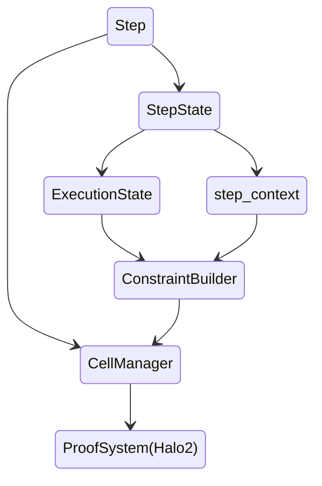

import ClickToZoom from "../../../components/ClickToZoom.astro"
import priceAggr from "../../../assets/images/contract-devs/price-aggr.png"
import ToggleElement from "../../../components/ToggleElement.astro"
import Aside from "../../../components/Aside.astro"
import MarkmapView from "../../../components/MarkmapView/index.astro"
import RPCTable from "../../../components/RPCTable/RPCTable.astro"

Đây là văn bản thân bài viết ngay dưới tiêu đề bài viết. Thông thường, đây chỉ là văn bản đoạn khá trực tiếp. Sau đó có **văn bản đậm**, và _văn bản in nghiêng_, và **_văn bản in đậm in nghiêng_**, và `mã nội dòng` và **`mã nội dòng in đậm`** và thậm chí còn _`mã nội dòng in nghiêng`_ và **_`mã nội dòng in đậm in nghiêng`_**. Và tất nhiên đừng quên [liên kết](#), và [**liên kết in đậm**](#), và [_liên kết in nghiêng_](#), và [**_liên kết in đậm in nghiêng_**](#).

## Các thành phần Markdown (cũng là tiêu đề H2)

- Chúng ta cũng có danh sách không có thứ tự!
- Chúng có thể có nhiều mục.
  - Và một số mục phụ.
  - Mà đi vào chi tiết.
- Đó là một danh sách không có thứ tự.

Còn gì khác chúng ta có?

1. Tất nhiên còn có danh sách có thứ tự.
1. Chúng trông như thế này.
1. Chúng khá hữu ích.

### Tiêu đề H3

#### Tiêu đề H4

##### Tiêu đề H5

Hãy xem một quy tắc ngang.

---

Chúng ta xác định dãy Square-Fibonacci sequence, một biến thể của Fibonacci sequence:

### Toán học

- Đặt $f_0 = 1, f_1 = 1$
- Đối với $$i \geq 2$$, xác định $f_{i} := (f_{i-2})^2 + (f_{i-1})^2 \mod q$
  - Ở đây, $q$ là một số nguyên tố lớn. Chúng tôi sử dụng mô đun này để giới hạn kích thước của mỗi phần tử, để nó có thể được biểu diễn bằng một số bit xác định trước.

### Bảng

| Cú pháp    | Mô tả |
| --------- | ----------- |
| Header    | Title       |
| Paragraph | Text        |

### Trích dẫn

> #### Thành công
>
> Vitae reprehenderit at aliquid error voluptates eum dignissimos.

### Chú thích

Dưới đây là một chú thích đơn giản,[^1] và đây là một chú thích dài hơn.[^chú thích_lớn]

[^1]: Đây là chú thích đầu tiên.
[^chú thích_lớn]: Đây là một chú thích với nhiều đoạn và mã.

### Ghi chú gọi

:::tip[Bạn có biết không?]
Astro giúp bạn xây dựng các trang web nhanh hơn với “Kiến trúc Cụm Đảo”.
:::

## Các thành phần MDX được nhập

### Ghi chú gọi

<Aside type="note" title="Ghi chú">
  {" "}
  Astro giúp bạn xây dựng các trang web nhanh hơn với “Kiến trúc Cụm Đảo”.{" "}
</Aside>
<Aside type="caution" title="Chú ý">
  {" "}
  Astro giúp bạn xây dựng các trang web nhanh hơn với “Kiến trúc Cụm Đảo”.{" "}
</Aside>
<Aside type="danger" title="Nguy hiểm">
  {" "}
  Astro giúp bạn xây dựng các trang web nhanh hơn với “Kiến trúc Cụm Đảo”.{" "}
</Aside>

<Aside type="tip" title="Mẹo">
  Đối với tệp .md, bạn có thể sử dụng mã này.
</Aside>

:::tip[Bạn có biết không?]
Astro giúp bạn xây dựng các trang web nhanh hơn với “Kiến trúc Cụm Đảo”.
:::

### Phóng to hình ảnh

<ClickToZoom src={priceAggr} />

### Chuyển đổi

<ToggleElement anchor="Tại sao nên xây dựng trên Scroll?">
  
Tại sao nên xây dựng trên Scroll?

  

    Scroll cho phép người tạo nội dung biến nội dung của họ thành các trải nghiệm tương tác, khám phá. Với Scroll, bạn có thể tạo
    ra các câu chuyện phong phú, tương tác mà thu hút độc giả, cung cấp trải nghiệm người dùng tốt hơn và giúp bạn nổi bật khỏi
    đám đông.
  

</ToggleElement>
<ToggleElement anchor="Scroll hoạt động như thế nào?">
  
Scroll hoạt động như thế nào?

  

    Scroll kết hợp các công nghệ mạnh mẽ như WebGL và WebRTC để tạo ra trải nghiệm tương tác, hấp dẫn. Nền tảng cho phép bạn xây
    dựng môi trường 3D, thêm tính tương tác và nhúng nội dung từ các dịch vụ web phổ biến để tạo ra một trải nghiệm độc đáo,
    thu hút cho đối tượng của bạn.
  

</ToggleElement>
<ToggleElement anchor="Tôi có thể xây dựng gì với Scroll?">
  
Tôi có thể xây dựng gì với Scroll?

  

    Bạn có thể xây dựng một loạt các trải nghiệm với Scroll, từ các bài viết tương tác đến các bản demo sản phẩm thực tế và
    các hành trình ảo. Scroll được thiết kế để giúp bạn tạo ra các trải nghiệm tương tác, hấp dẫn mà nâng cao nội dung của bạn và
    thu hút khán giả của bạn.
  

</ToggleElement>

### Markmap

#### Tệp Tham Khảo

<MarkmapView src="/samples/markmap.md" />

<MarkmapView>
markmap
===================

- beautiful2
- useful
- easy
- interactive

</MarkmapView>

### Mermaid

### RPC Table

<RPCTable />

